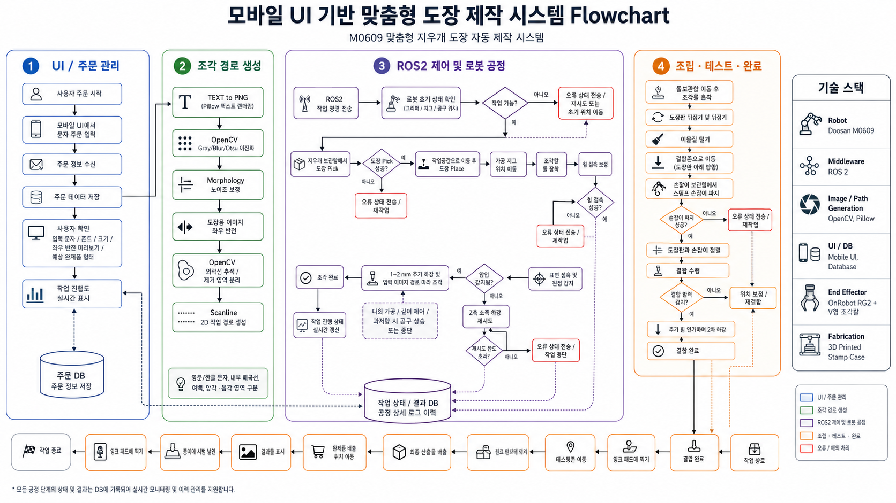
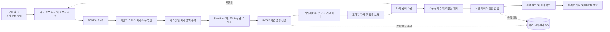

# M0609 맞춤형 지우개 도장 자동 제작 시스템

<p align="center">
  <strong>모바일 UI에서 입력한 문자를 로봇 가공 경로로 변환하고,<br>
  두산 협동로봇 M0609가 지우개 조각부터 도장 케이스 조립까지 수행하는 자동 제작 시스템</strong>
</p>

<p align="center">
  
  
  
  
  
</p>

---

## 1. 프로젝트 소개

본 프로젝트는 사용자가 모바일 또는 웹 UI에 입력한 영문·한글 문자를 기반으로 맞춤형 지우개 도장을 자동 제작하는 시스템입니다.

입력 문자는 도장 제작에 적합한 이미지와 2차원 가공 경로로 변환되며, 두산 협동로봇 **M0609**가 고정 지그와 사전 정의 좌표를 이용해 지우개를 가공합니다. 가공 완료 후에는 지우개를 회수하여 3D 프린터로 제작한 도장 케이스에 정렬·압입하고, 시험 날인과 완제품 배출까지 수행합니다.

이 시스템은 카메라와 같은 비전 센서를 사용하지 않습니다. 대신 다음 요소를 통해 위치 재현성을 확보합니다.

- 표준화된 지우개 규격
- 방향성이 있는 전용 지그
- 고정된 공구 및 조립 위치
- 사전 교정된 TCP와 작업 좌표
- 접촉 및 힘 제어 기반의 표면 보정

---

## 2. 핵심 목표

| ID | 목표 | 설명 |
|---|---|---|
| BG-01 | 맞춤형 도장의 소량 자동 생산 | 금형 없이 문자 데이터 변경만으로 1개 단위 제품 생산 |
| BG-02 | 수작업 조각 의존도 감소 | 작업자 숙련도에 따른 품질 편차 최소화 |
| BG-03 | 주문부터 조립까지 연속 자동화 | 문자 입력, 경로 생성, 조각, 조립, 배출을 하나의 공정으로 구성 |
| BG-04 | 다품종 소량생산 가능성 검증 | 로봇 재티칭 없이 입력 데이터와 가공 조건만 변경 |
| BG-05 | M0609 정밀 제어 능력 시연 | 곡선 추종, 힘 제어, 가공, 정밀 조립을 결합한 통합 시연 |

---

## 3. 전체 시스템 Flowchart

<p align="center">
  
</p>

### 공정 요약



---

## 4. 주요 기능

### 4.1 사용자 주문 및 확인

- 1회 제작 시 1~5자 입력
- 지원 폰트 및 글자 크기 선택
- 도장용 좌우 반전 결과 미리보기
- 지우개 내부 문자 배치 확인
- 예상 가공 범위와 완제품 형태 확인
- 사용자 최종 승인 후 로봇 공정 시작
- 작업 진행 단계와 오류 상태 실시간 표시

### 4.2 문자 이미지 및 경로 생성

입력 문자는 다음 순서로 가공 데이터로 변환됩니다.

1. Pillow를 이용한 문자 렌더링
2. OpenCV 기반 Gray 변환
3. Blur 및 Otsu 이진화
4. Morphology 기반 노이즈 제거
5. 도장 결과 방향을 고려한 좌우 반전
6. 외곽선과 내부 폐곡선 추출
7. 돌출 영역과 제거 영역 분리
8. Scanline 또는 벡터 기반 2차원 조각 경로 생성
9. 로봇 작업 좌표계로 스케일 및 오프셋 변환

다음 문자 구조를 구분할 수 있어야 합니다.

- 글자 외곽선
- 글자 내부의 닫힌 공간
- 양각으로 남길 영역
- 음각으로 제거할 영역
- 글자 사이 간격과 외곽 여백

### 4.3 로봇 조각 공정

- 보관 위치에서 지우개 Pick
- 가공 지그에 Place
- RG2에 장착된 V형 조각칼 사용
- 표면 접촉 및 가공 원점 보정
- 설정 깊이까지 단계적으로 하강
- 입력 경로를 따라 직선 및 곡선 조각
- 과도한 저항 감지 시 공구 상승 또는 작업 중단
- 구간별 공구 상승과 부스러기 제거
- 가공 진행률과 상태 로그 갱신

### 4.4 도장 케이스 조립

- 가공물 회수
- 도장판 방향 유지 또는 뒤집기
- 조각 부스러기 제거
- 손잡이 또는 케이스 파지
- 기계적 가이드 기반 정렬
- 힘 제어 기반 압입
- 결합 압력 확인
- 필요 시 위치 보정 후 재결합
- 완제품 배출 위치로 이동

### 4.5 시험 날인 및 작업 종료

- 테스트 위치 이동
- 잉크 패드 접촉
- 종이에 시험 날인
- 결과 표시 또는 작업자 확인
- 작업 완료 상태 모바일 UI 전송
- 작업 번호와 공정 결과 DB 저장

---

## 5. 기술 스택

### 필수 구성

| 구분 | 기술 |
|---|---|
| Robot | Doosan Robotics M0609 |
| End Effector | OnRobot RG2 |
| Tool | RG2 손가락 팁 장착형 V형 조각칼 |
| Middleware | ROS 2 Humble |
| Language | Python 3.10+ |
| Image Processing | OpenCV |
| Text Rendering | Pillow |
| Numerical Processing | NumPy |
| Path Generation | Contour, Scanline, Polyline/Spline |
| Robot Control | ROS 2 Node, Service, Action, Topic |
| Fabrication | 3D Printed Stamp Case / Jig |

### 권장 UI·서버 구성

UI와 서버는 실제 프로젝트 환경에 따라 변경할 수 있습니다.

| 구분 | 권장 기술 |
|---|---|
| Mobile/Web UI | React + Vite PWA 또는 Flutter |
| Backend API | FastAPI |
| Database | SQLite 개발 환경 / PostgreSQL 확장 환경 |
| Realtime Status | WebSocket 또는 ROS 2 상태 브리지 |
| Logging | Python logging + DB 공정 이력 |
| Configuration | YAML |

---

## 6. 시스템 아키텍처

```text
┌──────────────────────────────┐
│ Mobile / Web UI              │
│ - 문자 입력                  │
│ - 폰트·크기 선택             │
│ - 좌우 반전 미리보기         │
│ - 작업 진행도 표시           │
└──────────────┬───────────────┘
               │ REST / WebSocket
               ▼
┌──────────────────────────────┐
│ Order & Path Server          │
│ - 주문 정보 저장             │
│ - Pillow 문자 렌더링         │
│ - OpenCV 전처리              │
│ - Contour / Scanline 생성    │
│ - 좌표 스케일링              │
└──────────────┬───────────────┘
               │ ROS 2 Command
               ▼
┌──────────────────────────────┐
│ M0609 Robot Controller       │
│ - 지우개 Pick / Place        │
│ - 접촉 보정                  │
│ - 조각 경로 추종             │
│ - 힘 제어 및 오류 처리       │
│ - 케이스 조립                │
└──────────────┬───────────────┘
               │ Status / Result
               ▼
┌──────────────────────────────┐
│ Process Database             │
│ - 공정 상태                  │
│ - 가공 조건                  │
│ - 오류 단계                  │
│ - 작업 결과                  │
└──────────────────────────────┘
```

---

## 7. 비즈니스 요구사항

| ID | 요구사항 | 구현 방향 |
|---|---|---|
| BR-01 | 사용자 문자 입력 | UI에서 1~5자, 폰트, 크기 선택 |
| BR-02 | 도장용 문자 자동 변환 | 좌우 반전, 양각·음각·내부 영역 분리 |
| BR-03 | 영문 문자 제작 | 직선 → 대각선 → 곡선 → 내부 공간 순으로 검증 |
| BR-04 | 한글 문자 제작 | 완성형 글리프 기준 경로 생성 및 최소 획 두께 적용 |
| BR-05 | 표준화된 지우개 소재 | 단일 규격과 방향성이 있는 지그 사용 |
| BR-06 | 비전 없는 위치 재현성 | 고정 기준면, 작업 좌표, TCP 교정 |
| BR-07 | 지우개 손상 최소화 | 저속 접근, 다회 깊이 가공, 과저항 감지 |
| BR-08 | 문자 가독성 확보 | 획 단절, 침범, 내부 막힘 여부 확인 |
| BR-09 | 도장 케이스 자동 조립 | 가이드 구조와 힘 제어 압입 |
| BR-10 | 제품별 빠른 전환 | 문자 데이터만 교체하고 로봇 재티칭 생략 |
| BR-11 | 사용자 확인 기능 | 가공 전 미리보기와 최종 승인 |
| BR-12 | 작업 진행 상태 제공 | 단계별 상태와 오류 로그 표시 |
| BR-13 | 안전한 협동 작업 | 칼날 접근 제한, 정지 상태에서 교체·청소 |
| BR-14 | 가공 결과 추적 | 작업 번호, 가공 조건, 오류 단계, 완료 여부 저장 |

---

## 8. 초기 성능 목표

| 구분 | 목표 |
|---|---|
| 영문 제작 성공률 | 동일 조건 5회 중 4회 이상 |
| 문자 식별 가능 비율 | 제작 결과의 90% 이상 |
| 케이스 조립 성공률 | 동일 조건 10회 중 9회 이상 |
| 문자 위치 편차 | 기준 위치 대비 ±0.5 mm 이내 |
| 지우개 파손률 | 전체 작업의 10% 이하 |
| 한 제품 제작 시간 | 10분 이내 |
| 제품 전환 준비 시간 | 2분 이내 |
| 1차 대표 결과물 | `ROKEY` 양각 또는 음각 도장 |
| 작업자 개입 | 소재 공급과 완제품 회수 중심 |

---

## 9. 지원 문자 개발 순서

1. `I`, `L`, `T`, `E` — 직선 중심 문자
2. `A`, `K`, `M`, `N` — 대각선 포함 문자
3. `C`, `S`, `U` — 곡선 포함 문자
4. `B`, `O`, `P`, `R` — 내부 폐곡선 포함 문자
5. `ROKEY` — 다문자 배치와 전체 공정 검증
6. 한글 성씨 또는 이름 1~3자
7. 복잡한 받침과 폐곡선을 포함한 한글

---

## 10. 프로젝트 범위

### 포함 범위

- 모바일 또는 웹 UI 문자 입력
- 폰트와 문자 크기 선택
- 문자 외곽선 데이터 추출
- 좌우 반전 및 배치 변환
- 로봇 가공 경로 생성
- M0609 기반 지우개 조각
- 접촉력과 가공 깊이 관리
- 가공물 파지 및 이동
- 3D 프린팅 케이스 삽입
- 시험 날인과 완제품 배출
- 상태 및 오류 로그 저장

### 초기 제외 범위

- 손글씨 및 그림 자동 변환
- 사진 기반 도장 생성
- 복잡한 로고 및 인물 이미지
- 비정렬 소재의 자동 인식과 파지
- 대량 생산용 자동 공급 장치
- 실패 제품 자동 재가공
- 비전 기반 품질 검사

---

## 11. 주요 제약조건

1. 비전 센서를 사용하지 않습니다.
2. 모든 작업 대상은 지정 지그에 정해진 방향으로 배치합니다.
3. 초기에는 지우개와 케이스 규격을 각각 한 종류로 제한합니다.
4. 지원 폰트와 문자 크기를 제한합니다.
5. 조각칼의 형상과 장착 방향을 고정합니다.
6. 가공 전 TCP와 작업 좌표를 교정합니다.
7. 가공 중 발생한 부스러기는 별도 청소 단계에서 제거합니다.
8. 조각칼 접근 구역에는 안전 커버 또는 접근 제한 장치를 설치합니다.
9. 케이스 조립은 공차가 관리된 3D 프린팅 부품을 사용합니다.

---

## 12. 안전 요구사항

> 이 프로젝트는 날카로운 조각 공구를 사용하므로 일반적인 Pick & Place 시연보다 높은 수준의 안전 대책이 필요합니다.

- 정상 가공 중 작업자의 공구 접근 차단
- 비상 정지 스위치 접근성 확보
- 로봇 정지 상태에서만 공구 교체 및 지그 청소
- 가공 시작 전 그리퍼·공구·지그 상태 확인
- 접촉력 또는 위치 한계 초과 시 즉시 정지
- 조각 공정 중 속도와 가속도 제한
- 재시도 횟수 초과 시 자동 작업 중단
- 오류 발생 단계와 로봇 상태 기록

---

## 13. 주요 위험과 대응

| 위험 | 영향 | 대응 |
|---|---|---|
| 지우개가 절삭력에 의해 변형 | 문자 모양 왜곡 | 낮은 힘, 다회 가공, 단단한 지그 |
| 조각칼 방향과 이동 방향 불일치 | 찢어짐 또는 경로 이탈 | 공구 자세 정렬, 경로 분할, 진입·이탈 경로 적용 |
| 좌우 반전 누락 | 날인 결과가 거꾸로 출력 | 자동 반전과 가공 전 미리보기 |
| 소재 장착 위치 오류 | 전체 가공 위치 이탈 | 방향성이 있는 전용 지그 |
| 조각 부스러기 누적 | 재절삭 및 표면 손상 | 구간별 공구 상승과 청소 공정 |
| 케이스 출력 공차 불균일 | 조립 실패 | 출력 조건 표준화, 가이드·테이퍼 적용 |
| 획이 지나치게 가늘거나 복잡 | 문자 손상 또는 미가공 | 최소 획 두께, 최소 간격, 지원 폰트 제한 |
| 힘 제어 보정 실패 | 과도한 압입 또는 미접촉 | 접촉 탐색 한도와 재시도 횟수 제한 |

---

## 14. 개발 로드맵

### Phase 1 — 단일 영문 조각

- 직선 문자 1개 입력
- 좌우 반전
- 고정 깊이 가공
- 작업자 결과 확인

### Phase 2 — 복합 영문 조각

- 곡선과 내부 폐곡선 지원
- 다회 깊이 가공
- 글자 크기와 위치 자동 조정
- `ROKEY` 경로 생성 및 조각

### Phase 3 — 케이스 조립

- 가공된 지우개 자동 파지
- 방향 유지
- 3D 프린팅 케이스 자동 삽입
- 완제품 배출

### Phase 4 — 통합 시연

- 모바일 UI 주문
- 가공 미리보기와 승인
- 자동 조각
- 자동 조립
- 시험 날인
- 결과 DB 저장
- 완제품 제공

### Phase 5 — 한글 확장

- 완성형 한글 글리프 렌더링
- 최소 획 두께와 간격 검증
- 초성·중성·종성 조합별 테스트
- 1~3자 한글 도장 제작

---

## 15. 권장 저장소 구조

```text
m0609-custom-stamp/
├── README.md
├── docs/
│   ├── images/
│   │   └── m0609_stamp_system_flowchart.png
│   ├── business_requirements.md
│   └── safety.md
├── config/
│   ├── robot.yaml
│   ├── tool.yaml
│   ├── jig.yaml
│   └── carving.yaml
├── assets/
│   ├── fonts/
│   ├── previews/
│   └── generated_paths/
├── src/
│   ├── ui_server/
│   │   ├── api.py
│   │   └── database.py
│   ├── path_generator/
│   │   ├── text_renderer.py
│   │   ├── image_preprocessor.py
│   │   ├── contour_extractor.py
│   │   └── scanline_generator.py
│   ├── robot_control/
│   │   ├── m0609_controller.py
│   │   ├── rg2_controller.py
│   │   ├── carving_sequence.py
│   │   └── assembly_sequence.py
│   └── common/
│       ├── models.py
│       └── logger.py
├── launch/
│   └── stamp_system.launch.py
├── tests/
│   ├── test_path_generator.py
│   ├── test_coordinate_transform.py
│   └── test_process_state.py
└── requirements.txt
```

---

## 16. 실행 흐름 예시

> 아래 명령은 저장소 구성을 위한 예시입니다. 실제 노드명과 패키지명에 맞게 수정해야 합니다.

### Python 환경

```bash
python3 -m venv .venv
source .venv/bin/activate

pip install --upgrade pip
pip install opencv-python pillow numpy scipy pyyaml fastapi uvicorn
```

### ROS 2 워크스페이스 빌드

```bash
cd ~/ros2_ws
colcon build --symlink-install
source install/setup.bash
```

### 경로 생성 서버 실행

```bash
python3 src/ui_server/api.py
```

### ROS 2 통합 공정 실행

```bash
ros2 launch m0609_custom_stamp stamp_system.launch.py
```

---

## 17. 작업 상태 모델

| 상태 | 의미 |
|---|---|
| `WAITING_INPUT` | 문자 입력 대기 |
| `GENERATING_PATH` | 문자 이미지 및 경로 생성 |
| `WAITING_MATERIAL` | 지우개 장착 확인 |
| `PICKING` | 지우개 Pick |
| `CALIBRATING` | 표면 접촉 및 원점 보정 |
| `CARVING` | 조각 작업 |
| `CLEANING` | 이물질 제거 |
| `ASSEMBLING` | 케이스 조립 |
| `TEST_STAMPING` | 시험 날인 |
| `EJECTING` | 완제품 배출 |
| `COMPLETED` | 작업 완료 |
| `ERROR` | 오류 발생 |
| `EMERGENCY_STOP` | 비상 정지 |

---

## 18. 작업 이력 데이터 예시

```json
{
  "job_id": "STAMP-2026-0001",
  "text": "ROKEY",
  "font": "ApprovedSans-Bold",
  "font_size_mm": 18.0,
  "engraving_type": "relief",
  "mirror_applied": true,
  "carving_depth_mm": 1.8,
  "pass_count": 4,
  "start_time": "2026-07-23T09:00:00+09:00",
  "end_time": "2026-07-23T09:08:42+09:00",
  "result": "success",
  "error_stage": null,
  "operator_cancelled": false
}
```

---

## 19. 프로젝트 성공 기준

다음 조건을 만족하면 핵심 목표를 달성한 것으로 판단합니다.

- 입력한 `ROKEY`가 자동으로 로봇 가공 경로로 변환됩니다.
- 도장을 찍었을 때 문자가 정상 방향으로 식별됩니다.
- 직선, 곡선, 내부 공간을 포함한 문자를 제작할 수 있습니다.
- 로봇이 가공된 지우개를 도장 케이스에 자동 조립합니다.
- 문자 변경 시 로봇 동작을 새로 티칭하지 않습니다.
- 전체 공정 상태와 결과가 UI 및 DB에 기록됩니다.
- 시스템이 M0609의 정밀 경로 제어, 힘 제어, 조립 능력을 통합적으로 보여줍니다.

---

## 20. 향후 확장

- 한글 이름 도장 자동 제작
- 양각·음각 모드 선택
- 로고와 단순 아이콘 지원
- 자동 공구 교환
- 가공 깊이 자동 최적화
- 시험 날인 이미지 기반 품질 검사
- 지우개와 케이스 자동 공급 장치
- 주문 관리 및 제품 이력 서비스 연동

---

## License

프로젝트의 소스 코드와 설계 자료 공개 범위에 맞춰 라이선스를 지정하세요.

예시:

```text
MIT License
```
